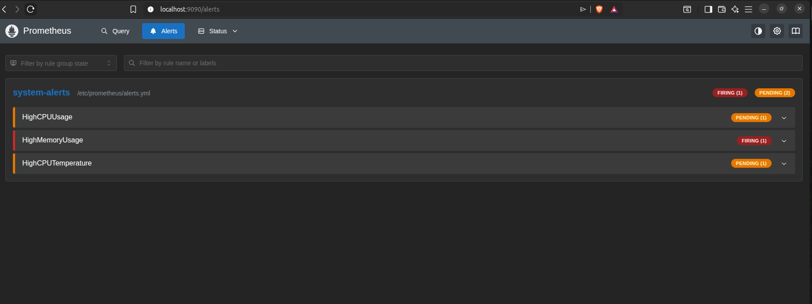
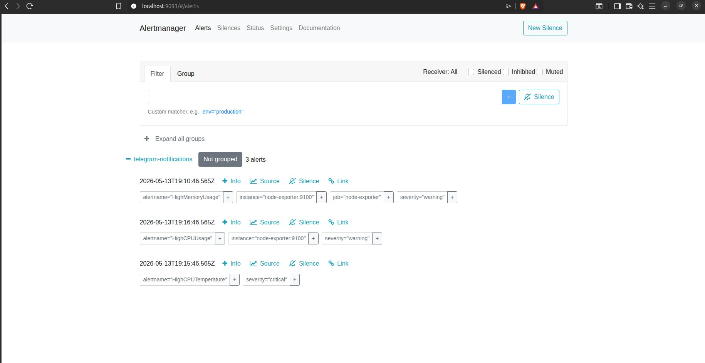
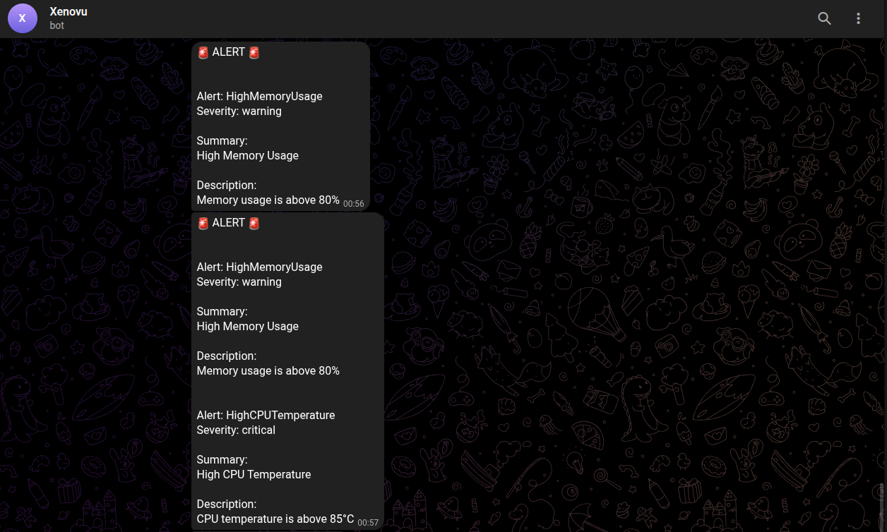
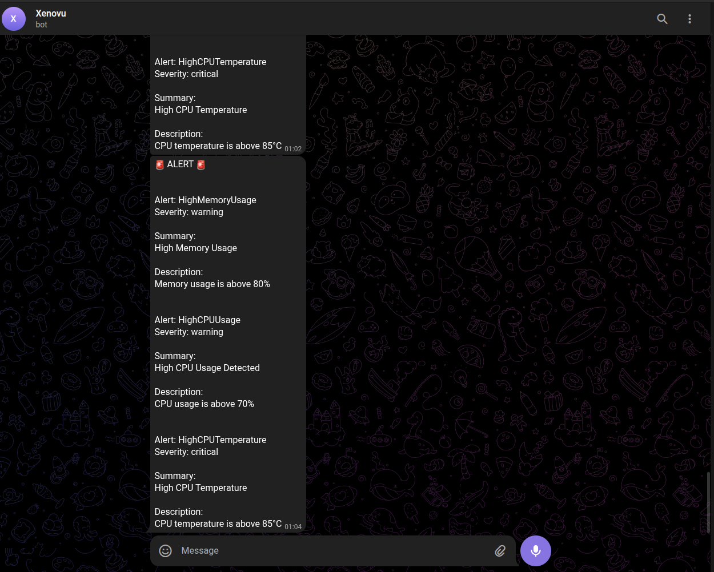
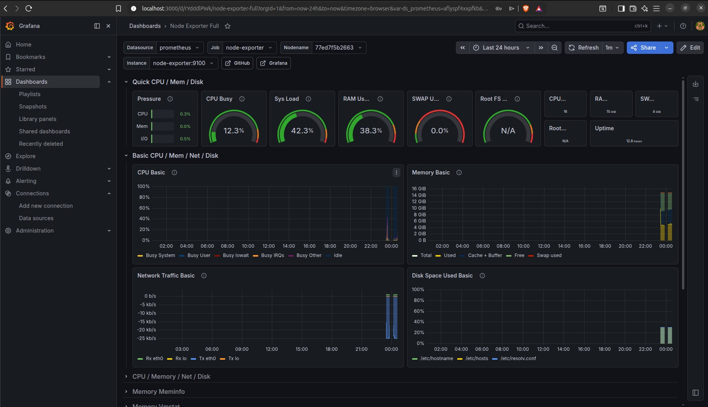

# Real-Time System Monitoring and Alerting

A Docker Compose based monitoring stack for Linux systems using Prometheus,
Grafana, Alertmanager, Node Exporter, cAdvisor, and Telegram alerts.

The goal is simple: clone the repository, add your credentials in `.env`, run
Docker Compose, and get monitoring plus alerts without manually editing YAML
secrets.

## Features

- Real-time Linux host metrics with Node Exporter
- Container metrics with cAdvisor
- Prometheus scraping and alert rules
- Alertmanager notifications through Telegram
- Grafana datasource and Node Exporter Full dashboard provisioned automatically
- Dockerized setup with persistent Prometheus, Grafana, and Alertmanager data
- `.env` based local configuration so secrets are not committed

## Services

| Service | URL |
|---|---|
| Grafana | http://localhost:3000 |
| Prometheus | http://localhost:9090 |
| Alertmanager | http://localhost:9093 |
| Node Exporter | http://localhost:9100/metrics |
| cAdvisor | http://localhost:8080 |

## Project Structure

```text
.
├── .env.example
├── .gitignore
├── alertmanager.yml
├── alerts.yml
├── docker-compose.yml
├── grafana/
│   ├── dashboards/
│   │   ├── node-exporter-full.json
│   │   └── system-overview.json
│   └── provisioning/
│       ├── dashboards/
│       │   └── system-monitoring.yml
│       └── datasources/
│           └── prometheus.yml
├── prometheus.yml
├── screenshots/
└── README.md
```

## Requirements

- Docker
- Docker Compose plugin, using the `docker compose` command
- A Telegram bot token and chat ID for alert notifications

This project is designed for Linux host monitoring. On Docker Desktop for macOS
or Windows, Node Exporter/cAdvisor may show metrics from the Docker VM instead
of the physical host.

## Quick Start

1. Clone the repository.

   ```bash
   git clone https://github.com/YOUR_USERNAME/real-time-system-monitoring.git
   cd real-time-system-monitoring
   ```

2. Create your local environment file.

   ```bash
   cp .env.example .env
   ```

3. Edit `.env` and add your values.

   ```env
   TELEGRAM_BOT_TOKEN=123456789:your-real-token
   TELEGRAM_CHAT_ID=123456789
   GRAFANA_ADMIN_USER=admin
   GRAFANA_ADMIN_PASSWORD=change-this-password
   ```

4. Start the stack.

   ```bash
   docker compose up -d
   ```

5. Open Grafana.

   ```text
   http://localhost:3000
   ```

   Log in with the Grafana username and password from `.env`. The Prometheus
   datasource, `Node Exporter Full`, and `System Overview` dashboards are
   provisioned automatically.

## Startup Behavior

The full stack expects Telegram alert credentials to be present in `.env`.

- `node-exporter` and `cadvisor` can start without Telegram credentials.
- `alertmanager` needs `TELEGRAM_BOT_TOKEN` and `TELEGRAM_CHAT_ID`.
- `prometheus` waits for Alertmanager.
- `grafana` waits for Prometheus.

Because of that, the complete monitoring stack starts only after `.env` has the
Telegram values. This keeps alerting configured correctly from the first full
run.

## Required Credentials

| Variable | Required | Description |
|---|---:|---|
| `TELEGRAM_BOT_TOKEN` | Yes | Telegram bot token created with `@BotFather` |
| `TELEGRAM_CHAT_ID` | Yes | Telegram user/group/channel chat ID that should receive alerts |
| `GRAFANA_ADMIN_USER` | No | Grafana admin username, defaults to `admin` |
| `GRAFANA_ADMIN_PASSWORD` | No | Grafana admin password, defaults to `admin` if not changed |

Do not commit `.env`. It is ignored by Git.

## Telegram Setup

1. Open Telegram and search for `@BotFather`.
2. Run `/newbot` and follow the prompts.
3. Copy the bot token into `.env` as `TELEGRAM_BOT_TOKEN`.
4. Send a message to your new bot.
5. Open this URL in a browser, replacing the token:

   ```text
   https://api.telegram.org/bot<YOUR_BOT_TOKEN>/getUpdates
   ```

6. Copy the `chat.id` value into `.env` as `TELEGRAM_CHAT_ID`.

For Telegram groups, add the bot to the group, send a message in the group, then
call `getUpdates`. Group chat IDs are often negative numbers.

## Alert Rules

Alert rules are stored in `alerts.yml`.

| Alert | Trigger |
|---|---|
| `HighCPUUsage` | CPU usage above 70 percent for 30 seconds |
| `HighMemoryUsage` | Memory usage above 80 percent for 30 seconds |
| `HighCPUTemperature` | CPU temperature above 85C for 30 seconds |

The temperature alert depends on `node_hwmon_temp_celsius`. Some systems do not
expose hardware temperature metrics to containers, so that alert may stay
inactive even when CPU and memory metrics work correctly.

## Grafana Dashboards

Grafana is provisioned automatically from files in `grafana/dashboards`.

| Dashboard | Description |
|---|---|
| `Node Exporter Full` | Prebuilt Grafana dashboard ID `1860` for detailed host metrics |
| `System Overview` | Small local dashboard with CPU, memory, temperature, and filesystem panels |

The Prometheus datasource is also provisioned automatically, so users do not
need to manually add a datasource after running Docker Compose.

## Useful Commands

Start the stack:

```bash
docker compose up -d
```

View running containers:

```bash
docker compose ps
```

View logs:

```bash
docker compose logs -f
```

Stop the stack:

```bash
docker compose down
```

Stop the stack and remove stored monitoring data:

```bash
docker compose down -v
```

## Testing Alerts

Install `stress` on the host if needed:

```bash
sudo apt update
sudo apt install stress -y
```

Trigger CPU load:

```bash
stress --cpu 8 --timeout 90
```

Trigger memory load:

```bash
stress --vm 2 --vm-bytes 2G --timeout 90
```

After about 30 seconds above the threshold, Prometheus should mark the alert as
firing and Alertmanager should send a Telegram message.

## Screenshots

### Prometheus Alerts



### Alertmanager



### Telegram Alerts





### Grafana Dashboard



## Troubleshooting

If containers do not start, validate the Compose file:

```bash
docker compose config
```

If Telegram alerts do not arrive:

- Confirm `.env` contains a real `TELEGRAM_BOT_TOKEN`.
- Confirm `TELEGRAM_CHAT_ID` is numeric.
- Send a message to the bot before calling `getUpdates`.
- Check Alertmanager logs with `docker compose logs alertmanager`.

If Grafana login does not use your new password, you may already have an
existing Grafana data volume. Either keep the old password or recreate the stack
with `docker compose down -v` and then `docker compose up -d`.

If the temperature panel has no data, your host may not expose hardware sensor
metrics to Node Exporter inside Docker.

## Security Notes

- Keep `.env` private.
- Rotate the Telegram bot token if it is ever committed or shared.
- Change `GRAFANA_ADMIN_PASSWORD` before running this on a shared machine.
- Avoid exposing ports `3000`, `9090`, `9093`, `9100`, or `8080` directly to the
  public internet without authentication and firewall rules.

## License

MIT License
